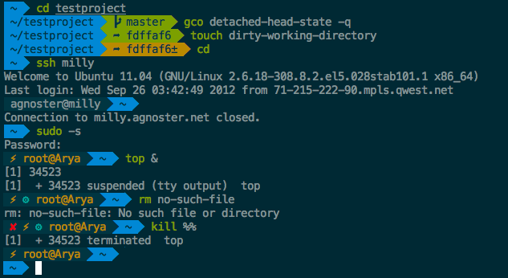

# Installing oh-my-bash

## Getting Started

### Prerequisites

_Disclaimer_: Oh My Bash works best on macOS and Linux.

- Unix-like operating system (macOS or Linux)
- curl or wget should be installed
- git should be installed

## Basic Installation

Oh My Bash is installed by running one of the following commands in your terminal. You can install this via the command-line with either curl or wget.

### via curl

```shell
bash -c "$(curl -fsSL https://raw.githubusercontent.com/ohmybash/oh-my-bash/master/tools/install.sh)"
```

### via wget

```shell
bash -c "$(wget https://raw.githubusercontent.com/ohmybash/oh-my-bash/master/tools/install.sh -O -)"
```

## Using Oh My Bash

### Plugins

Oh My Bash comes with a shit load of plugins to take advantage of. You can take a look in the plugins directory and/or the wiki to see what's currently available.

### Enabling Plugins

Once you spot a plugin (or several) that you'd like to use with Oh My Bash, you'll need to enable them in the .bashrc file. You'll find the bashrc file in your $HOME directory. Open it with your favorite text editor and you'll see a spot to list all the plugins you want to load.

For example, this line might begin to look like this:

```shell
plugins=(git bundler osx rake ruby)
```

### With Conditionals

You may want to control when and/or how plugins should be enabled.

For example, if you want the `tmux-autoattach` plugin to only run on SSH sessions, you could employ a trivial conditional that checks for the `$SSH_TTY` variable. Just make sure to remove the plugin from the larger plugin list.

```shell
[ "$SSH_TTY" ] && plugins+=(tmux-autoattach)
```

### Using Plugins

Most plugins (should! we're working on this) include a `README`, which documents how to use them.

## Themes

We'll admit it. Early in the Oh My Bash world, we may have gotten a bit too theme happy. We have over one hundred themes now bundled. Most of them have screenshots on our wiki or alternatively `oh-my-zsh` wiki.

### Selecting a Theme

Powerline's theme is the default one. It's not the fanciest one. It's not the simplest one. It's just the right one (for me).

Once you find a theme that you want to use, you will need to edit the ``````~/.bashrc`````` file. You'll see an environment variable (all caps) in there that looks like:

```shell
OSH_THEME="powerline"
```

To use a different theme, simply change the value to match the name of your desired theme. For example:

```shell
OSH_THEME="agnoster" # (this is one of the fancy ones)
# you might need to install a special Powerline font on your console's host for this to work
# see https://github.com/ohmybash/oh-my-bash/wiki/Themes#agnoster
```

Open up a new terminal window and your prompt should look something like this:



### Agnoster theme

In case you did not find a suitable theme for your needs, please have a look at the wiki for more of them.

If you're feeling feisty, you can let the computer select one randomly for you each time you open a new terminal window.

```shell
OSH_THEME="random" # (...please let it be pie... please be some pie..)
```

### Advanced Topics

If you're the type that likes to get their hands dirty, these sections might resonate.

#### Advanced Installation

Some users may want to change the default path, or manually install Oh My Bash.

#### Custom Directory

The default location is ~/.oh-my-bash (hidden in your home directory)

If you'd like to change the install directory with the OSH environment variable, either by running export OSH=/your/path before installing, or by setting it before the end of the install pipeline like this:

```shell
export OSH="$HOME/.dotfiles/oh-my-bash"; sh -c "$(curl -fsSL https://raw.githubusercontent.com/ohmybash/oh-my-bash/master/tools/install.sh)"
```

## Manual Installation

1. Clone the repository:
git clone `git://github.com/ohmybash/oh-my-bash.git ~/.oh-my-bash`
1. Optionally, backup your existing ~/.bashrc file:
cp `~/.bashrc ~/.bashrc.orig`
1. Create a new sh configuration file
    You can create a new sh config file by copying the template that we have included for you.
    `cp ~/.oh-my-bash/templates/bashrc.osh-template ~/.bashrc`
1. Reload your `.bashrc`
`source ~/.bashrc`

1. Initialize your new bash configuration
Once you open up a new terminal window, it should load sh with Oh My Bash's configuration.

### Installation Problems

If you have any hiccups installing, here are a few common fixes.

- You might need to modify your PATH in ~/.bashrc if you're not able to find some commands after switching to oh-my-bash.
- If you installed manually or changed the install location, check the OSH environment variable in `~/.bashrc`.
Custom Plugins and Themes
- If you want to override any of the default behaviors, just add a new file (ending in .sh) in the `custom/` directory.

If you have many functions that go well together, you can put them as a XYZ.plugin.sh file in the `custom/plugins/` directory and then enable this plugin.

If you would like to override the functionality of a plugin distributed with Oh My Bash, create a plugin of the same name in the `custom/plugins/` directory and it will be loaded instead of the one in `plugins/.`

### Getting Updates

By default, you will be prompted to check for upgrades every few weeks. If you would like oh-my-bash to automatically upgrade itself without prompting you, set the following in your `~/.bashrc:`

```conf
DISABLE_UPDATE_PROMPT=true
```

To disable automatic upgrades, set the following in your `~/.bashrc`:

```conf
DISABLE_AUTO_UPDATE=true
```

### Manual Updates

If you'd like to upgrade at any point in time (maybe someone just released a new plugin and you don't want to wait a week?) you just need to run:

```shell
upgrade_oh_my_bash
Magic!
```

### Uninstalling Oh My Bash

Oh My Bash isn't for everyone. We'll miss you, but we want to make this an easy breakup.

If you want to `uninstall oh-my-bash`, just run `uninstall_oh_my_bash` from the `command-line`. It will remove itself and revert your previous bash configuration.