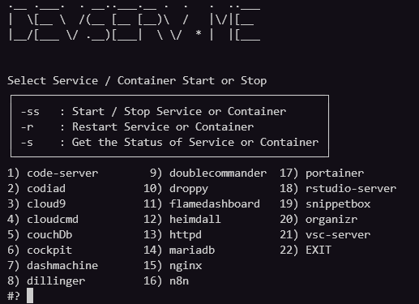

<script type="text/javascript">(function(w,s){var e=document.createElement("script");e.type="text/javascript";e.async=true;e.src="https://cdn.pagesense.io/js/webally/f2527eebee974243853bcd47b32631f4.js";var x=document.getElementsByTagName("script")[0];x.parentNode.insertBefore(e,x);})(window,"script");</script>
# Bash Scripting: Service menu

> Stopping and starting services and docker containers can be a pain, so i created a script to make it less irritating and boring to do.

## Use the service-menu (sm)

```shell
# I added the folder where I saved all my scripts to the PATH
# So just enter the following:
service-menu or sm
```

Something that looks like this or something close to this will be displayed


